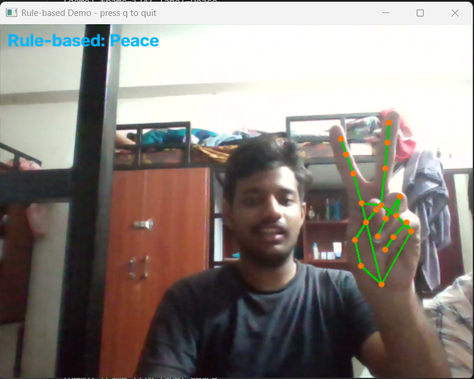
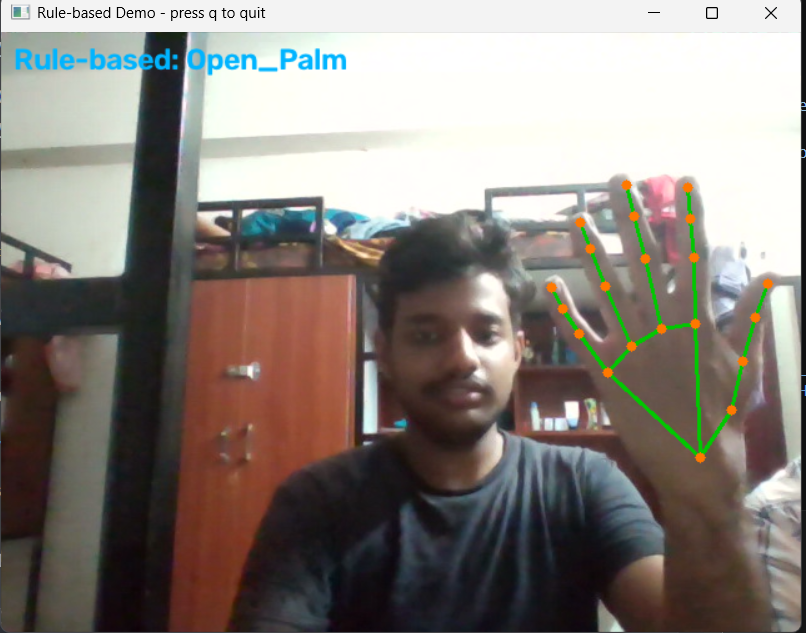
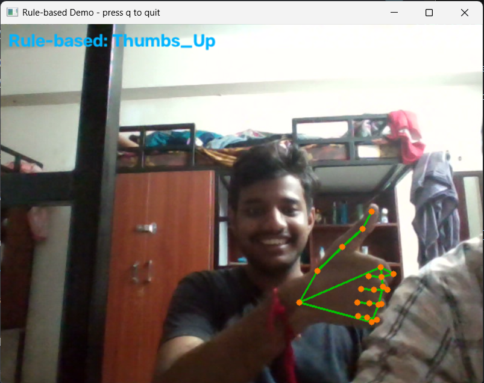
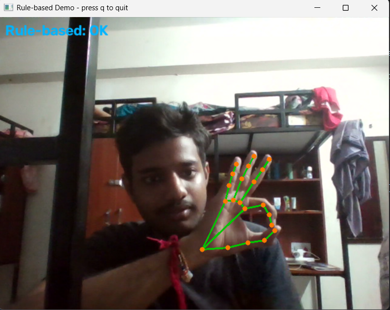

# Hand Gesture Recognition

A real-time computer vision project that recognizes hand gestures from a
webcam using **MediaPipe hand landmarks** and a **Random Forest
classifier**.

The project also contains a lightweight **rule-based recognizer**. This
gives us a useful baseline: instead of learning from examples, it
decides the gesture from the geometric arrangement of the detected
fingers.

## Demo

The application detects the hand, draws the 21 MediaPipe landmarks, and
displays the predicted gesture.

### Peace



### Open Palm



### Thumbs Up



### OK



## What the project recognizes

The current dataset and demo support these six gestures:

-   `Open_Palm`
-   `Fist`
-   `Thumbs_Up`
-   `Peace`
-   `Pointing`
-   `OK`

The implementation is not limited to these labels. Additional gestures
can be introduced by collecting examples with a new label and retraining
the model.

------------------------------------------------------------------------

## How it works

The recognition pipeline can be summarized as:

``` text
Camera / Video
      |
      v
OpenCV frame capture
      |
      v
MediaPipe Hand Landmarker
      |
      v
21 hand landmarks (x, y, z)
      |
      v
Feature extraction
- wrist-centered coordinates
- scale normalization
- geometric relationships
      |
      +--------------------------+
      |                          |
      v                          v
Random Forest              Rule-based logic
trained from data          finger-state heuristics
      |                          |
      +------------+-------------+
                   |
                   v
             Gesture label
```

### 1. Hand detection

`src/hand_tracker.py` handles MediaPipe's hand-landmark model and
converts a video frame into a set of hand landmarks.

Each detected hand is represented using **21 landmark points** covering
the wrist, fingers, and joints.

### 2. Feature generation

`src/features.py` turns those landmarks into a fixed-size numerical
representation.

The feature vector contains normalized landmark information along with
additional geometric measurements. The normalization is designed to
reduce the effect of:

-   Hand position inside the camera frame
-   Distance between the hand and camera
-   Moderate changes in hand orientation

The resulting representation contains **73 features**.

### 3. Two recognition approaches

#### Machine-learning model

The ML path uses a **Random Forest classifier**. It learns the
relationship between the 73-dimensional feature vector and the gesture
label from examples collected through the webcam.

#### Rule-based baseline

The rule-based path does not require training. It estimates whether
individual fingers are extended using geometric conditions and combines
those observations into a gesture decision.

Having both approaches makes it possible to compare a learned model with
a manually designed baseline.

------------------------------------------------------------------------

## Project layout

``` text
hand-gesture-recognition/
│
├── cli.py                    # Main command-line interface
├── requirements.txt          # Python dependencies
├── README.md
│
├── src/
│   ├── hand_tracker.py       # MediaPipe hand detection
│   ├── features.py           # Landmark normalization and features
│   ├── rule_based.py         # Heuristic gesture recognition
│   ├── collect_data.py       # Training-data collection
│   ├── train_model.py        # Model training and evaluation
│   └── recognize.py          # Live/video recognition
│
├── data/                     # Recorded feature data (ignored by Git)
├── models/                   # Saved models and MediaPipe assets
└── report/                   # Project documentation
```

------------------------------------------------------------------------

## Requirements

You will need:

-   Python **3.9--3.12**
-   A working webcam for live collection/recognition
-   Or a video file if you want to run the pipeline without a webcam
-   Internet access during the first model setup so the MediaPipe
    hand-landmark asset can be obtained

The exact Python packages are listed in `requirements.txt`.

------------------------------------------------------------------------

## Installation

Clone the repository and create a virtual environment:

``` bash
git clone https://github.com/<your-username>/<your-repository>.git
cd <your-repository>

python3 -m venv venv
```

Activate it:

### Windows

``` bash
venv\Scripts\activate
```

### Linux / macOS

``` bash
source venv/bin/activate
```

Then install the dependencies:

``` bash
pip install -r requirements.txt
```

The required MediaPipe hand model is handled by the project when a
command that needs hand detection is first executed. It is then reused
locally.

------------------------------------------------------------------------

## Quick start

If you only want to see the rule-based recognizer working, run:

``` bash
python cli.py demo
```

This starts the camera, detects the hand, draws its landmarks, and shows
the predicted gesture.

Press **`q`** to close the window.

------------------------------------------------------------------------

## Training your own classifier

The ML model needs labeled examples before it can be trained.

### Step 1 --- Collect examples

Run the collection command separately for each gesture:

``` bash
python cli.py collect --label Open_Palm --samples 150
python cli.py collect --label Fist --samples 150
python cli.py collect --label Thumbs_Up --samples 150
python cli.py collect --label Peace --samples 150
python cli.py collect --label Pointing --samples 150
python cli.py collect --label OK --samples 150
```

The extracted feature vectors are stored in:

``` text
data/gestures.csv
```

While collecting data, do not keep your hand in exactly one position.
Try small changes in:

-   Distance from the webcam
-   Horizontal/vertical position
-   Rotation of the hand
-   Natural variation in how the gesture is held

This gives the classifier more varied examples to learn from.

Press **`q`** if you want to stop collection before the requested number
of samples is reached.

### Step 2 --- Train and evaluate

Once enough data has been collected:

``` bash
python cli.py train
```

The training process:

1.  Reads the recorded CSV data.
2.  Separates examples into training and testing portions.
3.  Fits the Random Forest model.
4.  Reports evaluation metrics, including accuracy and a classification
    report.
5.  Generates a confusion matrix for inspecting class-level errors.
6.  Saves the trained classifier and label encoder.

The resulting files are placed under:

``` text
models/
├── gesture_model.joblib
└── label_encoder.joblib
```

### Step 3 --- Start recognition

Run:

``` bash
python cli.py recognize
```

The application will process the camera stream and display both
predictions, allowing the learned model and the rule-based baseline to
be observed side by side.

Press **`q`** to exit.

------------------------------------------------------------------------

## Using a video instead of a webcam

The commands can also process a video file.

For example, to collect samples from a video without opening an OpenCV
display window:

``` bash
python cli.py collect \
    --label Fist \
    --source path/to/video.mp4 \
    --no-window \
    --samples 100
```

To run recognition over a limited number of video frames:

``` bash
python cli.py recognize \
    --source path/to/video.mp4 \
    --no-window \
    --max-frames 200
```

The `--no-window` option is useful on machines without a graphical
display, such as some servers or CI environments.

------------------------------------------------------------------------

## Command reference

Show the main options:

``` bash
python cli.py --help
```

Get help for a particular operation:

``` bash
python cli.py collect --help
python cli.py train --help
python cli.py recognize --help
python cli.py demo --help
```

### Available commands

  Command       Purpose
  ------------- ------------------------------------------------
  `collect`     Capture labeled landmark features
  `train`       Train and evaluate the Random Forest
  `recognize`   Run ML + rule-based recognition
  `demo`        Try the rule-based recognizer without training

------------------------------------------------------------------------

## Why use landmarks instead of the original image?

A direct image classifier could learn gestures from raw pixels, but this
project deliberately works with hand landmarks.

That design has a few practical advantages:

-   The input is much smaller than a full camera image.
-   Training is lightweight enough for a normal CPU-based laptop.
-   The extracted representation focuses on hand geometry rather than
    background details.
-   The features are easier to inspect and explain.
-   Position and scale normalization can make the representation less
    sensitive to where the hand appears in the frame.

This does not mean landmark-based recognition is universally better than
image-based deep learning. It is simply a practical design choice for a
compact, explainable gesture-recognition system.

------------------------------------------------------------------------

## Rule-based vs ML recognition

  -----------------------------------------------------------------------
  Aspect                  Random Forest           Rule-based
  ----------------------- ----------------------- -----------------------
  Training data           Required                Not required

  Learning                Learns from recorded    Uses manually defined
                          examples                conditions

  Adaptability            Can improve with        Requires changes to the
                          representative data     rules

  Runtime                 Lightweight             Very lightweight

  Main purpose            Learned gesture         Baseline / quick
                          classification          demonstration
  -----------------------------------------------------------------------

The two methods serve different purposes. The rule-based version
provides a simple reference point, while the Random Forest can learn
patterns that are difficult to encode manually.

------------------------------------------------------------------------

## Improving recognition quality

If predictions are unreliable, try the following:

1.  Record more examples for every gesture.
2.  Keep the number of samples reasonably balanced across labels.
3.  Include different hand positions and distances during data
    collection.
4.  Avoid covering the hand or fingers with objects.
5.  Make sure the entire hand is visible when possible.
6.  Retrain the model after collecting improved data.
7.  Check the confusion matrix to identify which gestures are being
    mixed up.

For very similar gestures, better data diversity is often more useful
than simply collecting many nearly identical frames.

------------------------------------------------------------------------

## Adding a new gesture

A new gesture does not require changing the overall pipeline.

For example:

``` bash
python cli.py collect --label Rock --samples 150
```

After collecting examples for the new label, retrain:

``` bash
python cli.py train
```

The label encoder and Random Forest will then include the new class,
provided the training code accepts the collected label.

If you want the **rule-based** recognizer to understand the new gesture
too, its heuristic logic must also be extended in `src/rule_based.py`.

------------------------------------------------------------------------

## Troubleshooting

  ------------------------------------------------------------------------
  Problem                             What to check
  ----------------------------------- ------------------------------------
  `Could not open video source`       Check whether the webcam is
                                      available or already being used by
                                      another application. Try `--source`
                                      with a video file.

  MediaPipe model cannot be obtained  Check the internet connection and
                                      follow the model path/error
                                      information shown by the
                                      application.

  Predictions are inaccurate          Collect more varied samples and
                                      retrain the model.

  A gesture is frequently confused    Inspect the confusion matrix and
  with another                        collect more examples for the
                                      affected classes.

  `ModuleNotFoundError`               Activate the virtual environment and
                                      run
                                      `pip install -r requirements.txt`.

  No GUI/display is available         Add `--no-window` and use a video
                                      source where appropriate.
  ------------------------------------------------------------------------

------------------------------------------------------------------------

## Files generated during use

The project keeps user-generated training data and model files separate
from the source code:

``` text
data/
└── gestures.csv

models/
├── hand_landmarker.task
├── gesture_model.joblib
└── label_encoder.joblib
```

These generated files can be kept out of version control if the
repository's `.gitignore` is configured accordingly.

------------------------------------------------------------------------

## Project goals

This project demonstrates a complete small-scale computer-vision
workflow:

**capture → landmark detection → feature engineering → classification →
real-time prediction**

It is also intended as a comparison between a traditional hand-crafted
approach and a supervised machine-learning approach using the same
landmark representation.

------------------------------------------------------------------------

## License

Add the license you intend to use for the repository here, for example
MIT, Apache-2.0, or another license appropriate to your project.
